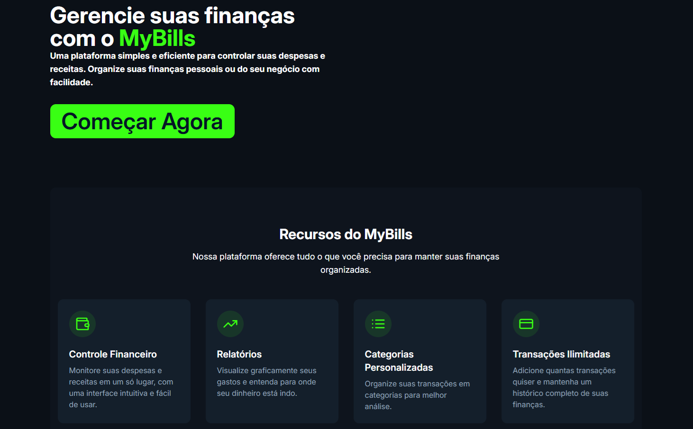
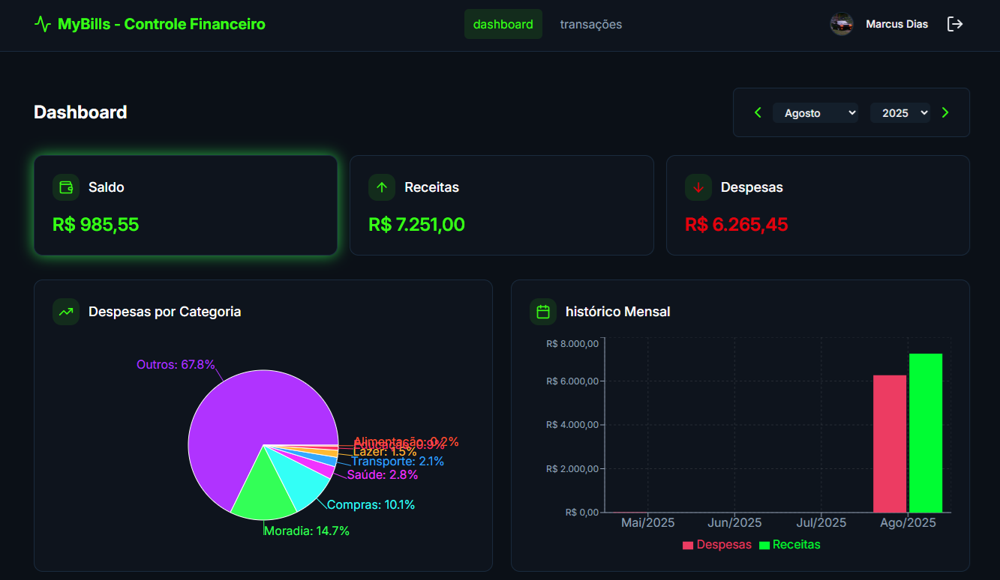
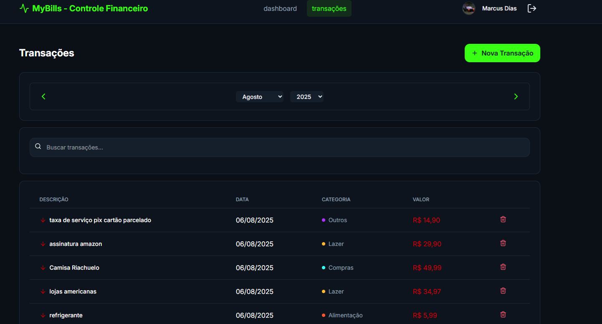
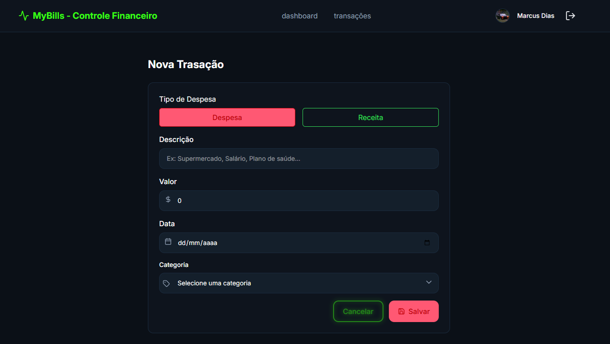

# 💰 MyBills - Controle Financeiro | Financial Control

> Aplicação web fullstack para gerenciamento financeiro pessoal.  
> Fullstack web application for personal financial management.

------

## 🧠 Sobre | About

**MyBills** é um projeto de controle financeiro pessoal com cadastro, login, registro de transações (entradas e saídas), gráficos, responsividade e integração com Firebase e uma API Fastify + Prisma.  
**MyBills** is a personal financial control project with registration, login, transaction logging (incomes and expenses), charts, responsiveness, and integration with Firebase and a Fastify + Prisma API.

------

## Screenshots 

## 📁 Estrutura do Projeto | Project Structure

MyBills/
├── interface/     # Frontend (React + TypeScript + TailwindCSS)
├── api/           # Backend (Fastify + TypeScript + Prisma + Firebase Admin)

-------

🚀 Funcionalidades | Features

| Português                                  | English                                  |
| ------------------------------------------ | ---------------------------------------- |
| Autenticação com Firebase (Email + Google) | Firebase Authentication (Email + Google) |
| Registro e login de usuários               | User registration and login              |
| Registro de transações financeiras         | Register financial transactions          |
| Filtro por mês e ano                       | Filter by month and year                 |
| Gráficos de pizza para entradas e saídas   | Pie charts for incomes and expenses      |
| Dashboard resumida com totalizadores       | Summary dashboard with totals            |
| Responsividade total                       | Fully responsive design                  |

------

🛠️ Tecnologias | Technologies
Frontend (interface):

React

TypeScript

Tailwind CSS

React Router Dom

React Hook Form

Firebase Auth (client)

Axios

Backend (api):

Fastify

TypeScript

Firebase Admin SDK

Prisma ORM

MongoDB (ou outro banco compatível)

-------

📦 Instalação | Installation

🔹 Clonar o repositório | Clone the repository
bash
Copiar
Editar
git clone https://github.com/MVSDias/MYBILLS.git
cd mybills

🔹 FRONTEND - Interface
bash
Copiar
Editar
cd interface
npm install
npm run dev
Acesse: https://mybills-interface.vercel.app/
Access: https://mybills-interface.vercel.app/

🔹 BACKEND - API
bash
Copiar
Editar
cd api
npm install
npx prisma generate
npx prisma migrate dev
npm run start
A API estará disponível em: https://mybillsapi.onrender.com/
The API will be available at: https://mybillsapi.onrender.com/

--------

📄 Licença | License
MIT License.
Esse projeto é de código aberto, sinta-se livre para contribuir.
This project is open source, feel free to contribute!

-------

🙋‍♂️ Autor | Author

Nome	Marcus Dias
GitHub	github.com/MVSDias
